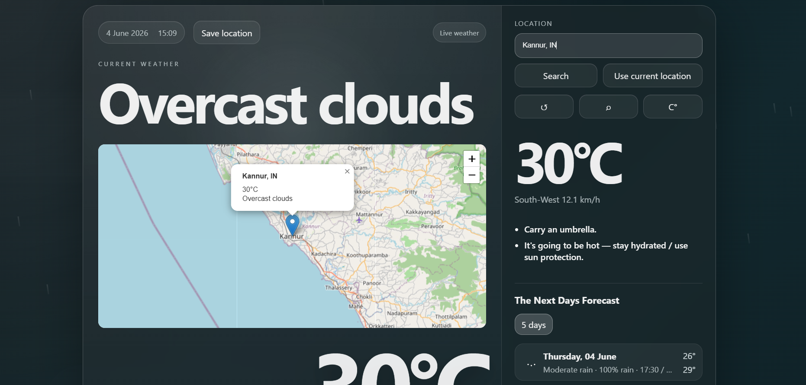
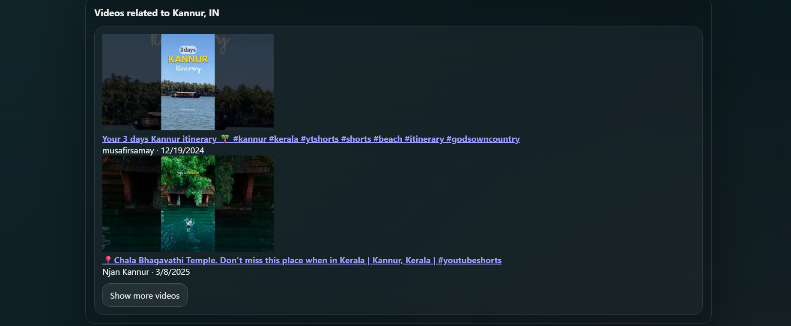

# WeatherScope - Advanced Weather Dashboard

## Overview

WeatherScope is a full-stack weather dashboard built using React, FastAPI, and MySQL. It provides real-time weather information, air quality monitoring, weather forecasts, interactive maps, location comparison, historical weather management, PDF report generation, and location-based video recommendations.

The application allows users to search for locations worldwide, view detailed weather conditions, compare multiple cities, save weather records, and explore weather trends through an intuitive and modern user interface.

---

## Key Highlights

- Real-time weather monitoring for any location
- Interactive weather maps using Leaflet and OpenStreetMap
- Air Quality Index (AQI) tracking
- Hourly and multi-day weather forecasts
- Weather history storage with MySQL
- Custom date range weather explorer
- PDF report generation
- City-to-city weather comparison
- Location-based YouTube video recommendations
- Built with React, FastAPI, and MySQL

---

## Features

### Real-Time Weather

- Current weather conditions
- Temperature display
- Wind speed and direction
- Humidity levels
- Pressure information
- Visibility data
- UV Index
- Air Quality Index (AQI)

### Forecasting

- Hourly weather forecast
- Multi-day weather forecast
- Rain probability prediction
- Sunrise and sunset timings

### Interactive Maps

- OpenStreetMap integration
- Interactive weather markers
- Location-based weather popups
- Zoom and navigation controls

### Location Management

- Search weather by city
- Use current location
- Save locations for future access
- Weather history tracking

### Weather Range Explorer

- Select custom date ranges
- Save weather records to database
- Retrieve historical weather information
- Edit saved records
- Delete saved records

### PDF Export

- Generate downloadable weather reports
- Export saved weather data as PDF

### Location Comparison

- Compare weather between cities
- Temperature difference analysis
- AQI comparison
- Weather condition comparison

### Video Integration

- Location-based YouTube recommendations
- Travel and informational videos related to selected locations

---

## Technologies Used

### Frontend

- React
- Vite
- JavaScript (ES6+)
- HTML5
- CSS3

### Backend

- Python
- FastAPI
- Uvicorn

### Database

- MySQL

### APIs & Libraries

- OpenWeather API
- YouTube Data API
- OpenStreetMap
- Leaflet.js

---

## Project Architecture

```text
Frontend (React + Vite)
         ↓
    FastAPI Backend
         ↓
      MySQL Database
         ↓
 External APIs & Services
(OpenWeather, YouTube,
 OpenStreetMap, Leaflet)
```

---

## Installation & Setup

### 1. Clone the Repository

```bash
git clone <repository-url>
cd weather-dashboard
```

### 2. Frontend Setup

Install dependencies:

```bash
npm install
```

Start the development server:

```bash
npm run dev
```

Frontend will run at:

```text
http://localhost:5173
```

### 3. Backend Setup

Navigate to the backend directory:

```bash
cd backend
```

Install dependencies:

```bash
pip install -r requirements.txt
```

Start the FastAPI server:

```bash
python -m uvicorn app.main:app --reload --port 8000
```

Backend will run at:

```text
http://localhost:8000
```

---

## Environment Variables

Create a `.env` file and configure the following variables:

```env
WEATHER_API_KEY=your_weather_api_key
YOUTUBE_API_KEY=your_youtube_api_key

DB_HOST=localhost
DB_USER=root
DB_PASSWORD=your_password
DB_NAME=weather_dashboard
```

---

## Database Setup

1. Create a MySQL database.
2. Import the provided SQL file.
3. Update database credentials in the `.env` file.
4. Start the backend server.
5. Launch the frontend application.

---

## API Keys Required

The application requires:

- OpenWeather API Key
- YouTube Data API Key

Add both keys to the `.env` file before running the application.

---

## Repository Structure

```text
weather-dashboard/
│
├── frontend/
│   ├── src/
│   ├── public/
│   ├── package.json
│   └── vite.config.js
│
├── backend/
│   ├── app/
│   ├── requirements.txt
│   └── main.py
│
├── screenshots/
│
├── README.md
├── .gitignore
└── database.sql
```

---

## Screenshots

### Main Dashboard

Displays current weather conditions, AQI, forecasts, and interactive maps.



### Weather Range Explorer

Save and retrieve weather information for custom date ranges.


### Location Comparison

Compare temperature, AQI, and weather conditions between locations.


### Video Recommendations

View location-related YouTube content directly from the dashboard.



---

## Future Improvements

- User authentication and authorization
- Weather alerts and notifications
- Advanced analytics and charts
- Mobile application support
- User-specific saved locations
- Weather trend visualizations
- Dark/Light theme customization

---

## Author

**Sreemsun Anand**

Final Year B.Tech Student

---

## License

This project is developed for educational, learning, and portfolio purposes.
